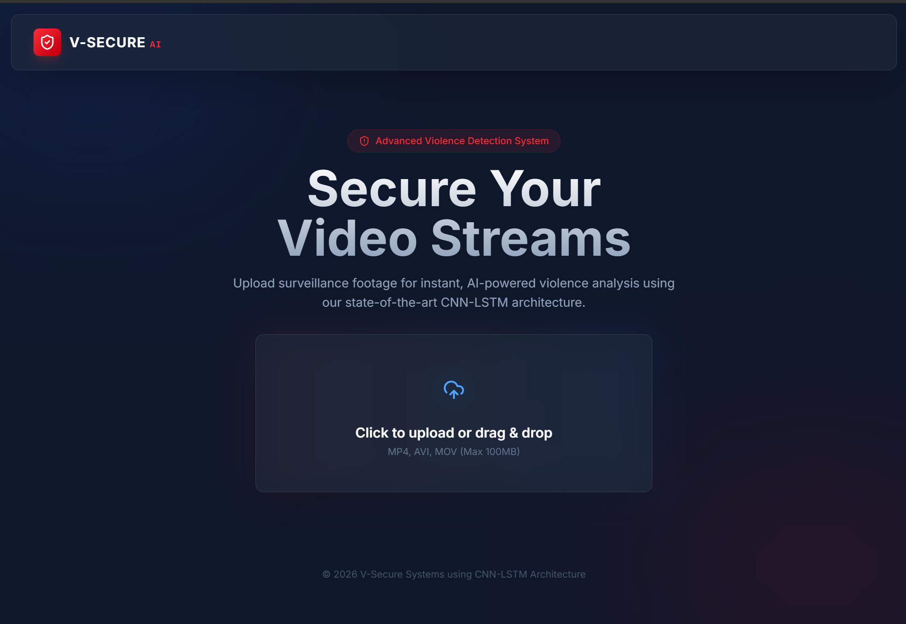
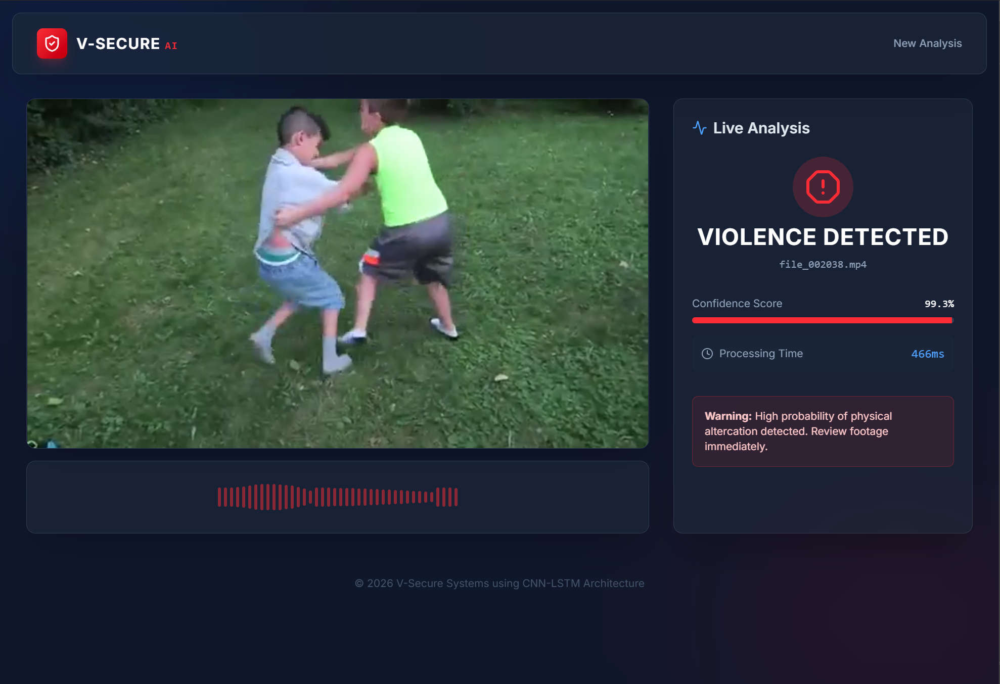

<div align="center">

# 🛡️ Video Violence Detection Web App

**A full-stack AI-powered web application for real-time violence detection in videos, leveraging state-of-the-art deep learning architectures. Built with React, FastAPI, and PyTorch — achieving a 0.98 F1-score with VideoMAE.**

[](https://react.dev/)
[](https://fastapi.tiangolo.com/)
[](https://pytorch.org/)
[](https://huggingface.co/)
[](LICENSE)
[](https://python.org/)

</div>

---

## 📸 App Screenshots

<div align="center">

| Upload Interface | Violence Detection Result |
|:---:|:---:|
|  |  |

</div>

---

## ✨ Key Features

- **🎯 Real-Time Inference** — Upload any video and receive instant violence classification with confidence scores and processing time.
- **🧠 Multi-Model Comparison** — Systematically benchmarked 4 deep learning architectures (VideoMAE, YOLO+LSTM, R(2+1)D, CNN-LSTM) to identify the optimal solution.
- **🖥️ Modern Web Interface** — Sleek, dark-themed React frontend ("V-SECURE AI") with glassmorphism effects, smooth animations via Framer Motion, and an intuitive drag-and-drop upload experience.
- **⚡ FastAPI Backend** — High-performance async API with automatic OpenAPI/Swagger documentation, structured Pydantic responses, and CORS-ready deployment.
- **📊 Rigorous Data Engineering** — RLVS + RWF-2000 datasets cleaned with duplicate removal, data leakage prevention, and duration outlier truncation.
- **🔬 End-to-End Research Pipeline** — Full Jupyter notebooks covering EDA, training, evaluation, and comparison across all architectures.

---

## 🏗️ Model Architecture & Performance

Four architectures were trained and evaluated on the combined **RLVS + RWF-2000** dataset using **2× Tesla T4 GPUs** with HuggingFace Accelerate for distributed training:

| # | Architecture | Backbone | Temporal Modeling | F1-Score | Notes |
|:-:|:---|:---|:---|:---:|:---|
| 🥇 | **VideoMAE** | ViT (Video Masked Autoencoder) | Self-Attention | **0.982** | **Best model — state-of-the-art** |
| 🥈 | **YOLO + LSTM** | YOLOv8 (Object Detection) | BiLSTM | **0.711** | Strong detection-based approach |
| 🥉 | **Pretrained R(2+1)D** | R(2+1)D-18 | 3D Convolutions | 0.97 | Solid spatiotemporal baseline |
| 4 | **CNN-LSTM** | ResNet-50 (ImageNet V2) | BiLSTM | 0.961 | Classical two-stage pipeline |

> **Note:** The web app currently deploys the **CNN-LSTM** model for real-time inference via the FastAPI backend. VideoMAE and YOLO+LSTM models are also available in the `models/` directory.

---

## 🔬 Data Engineering (EDA)

The training dataset was assembled from two public benchmarks:

| Dataset | Description |
|:---|:---|
| **RLVS** | Real Life Violence Situations dataset |
| **RWF-2000** | Real World Fighting dataset (2,000 clips) |

### Data Cleaning Pipeline
1. **Duplicate Removal** — Identified and removed duplicate videos across both datasets using perceptual hashing.
2. **Data Leakage Prevention** — Ensured zero overlap between train/validation/test splits to guarantee reliable evaluation metrics.
3. **Duration Outlier Truncation** — Analyzed video length distributions and truncated extreme outliers to standardize input and reduce noise.

> Full EDA analysis available in [`video-violence-detection-eda.ipynb`](video-violence-detection-eda.ipynb)

---

## 📁 Project Structure

```
Video-Violence-Detection-Web-App/
├── backend/
│   ├── main.py              # FastAPI application & /predict endpoint
│   ├── model.py             # CNN-LSTM model architecture (ResNet50 + BiLSTM)
│   ├── schemas.py           # Pydantic response models
│   └── utils.py             # Video preprocessing & frame extraction
├── frontend/
│   ├── src/
│   │   ├── App.jsx          # Main application component
│   │   └── components/
│   │       ├── HeroSection.jsx         # Upload interface
│   │       └── AnalysisDashboard.jsx   # Results & analysis view
│   ├── package.json
│   └── vite.config.js
├── models/                  # Trained model weights (.pth)
│   ├── best_videomae.pth
│   ├── best_yolo_lstm.pth
│   ├── best_cnn_lstm.pth
│   └── best_model.pth
├── screenshots/             # App UI screenshots
├── notebooks/
│   ├── video-violence-detection-eda.ipynb
│   ├── video-violence-detection-comparison-CNN+LSTM-VideoMAE-YOLO+LSTM.ipynb
│   └── video-violence-detection-R(2+1)D-Baseline.ipynb
└── README.md
```

---

## 🚀 Installation & Setup

### Prerequisites

- **Python** 3.10+
- **Node.js** 18+
- **Git**
- **(Optional)** CUDA-compatible GPU for faster inference

### 1. Clone the Repository

```bash
git clone https://github.com/YassirCher/Video-Violence-Detection-Web-App.git
cd Video-Violence-Detection-Web-App
```

### 2. Backend Setup (FastAPI)

```bash
# Create and activate a virtual environment
python -m venv venv
venv\Scripts\activate        # Windows
# source venv/bin/activate   # macOS/Linux

# Install dependencies
pip install fastapi uvicorn torch torchvision opencv-python numpy pydantic

# Start the backend server
python -m uvicorn backend.main:app --reload --host 0.0.0.0 --port 8000
```

The API will be available at **http://localhost:8000** with interactive docs at **http://localhost:8000/docs**.

### 3. Frontend Setup (React + Vite)

```bash
# Navigate to the frontend directory
cd frontend

# Install dependencies
npm install

# Start the development server
npm run dev
```

The frontend will be available at **http://localhost:5173**.

### 4. Usage

1. Open the frontend at `http://localhost:5173`
2. Drag & drop (or click to browse) a video file
3. The app sends the video to the FastAPI backend for inference
4. View the classification result (**Violence Detected** / **No Violence**), confidence score, and processing time

---

## 🛠️ Tech Stack

<div align="center">

| Layer | Technology |
|:---|:---|
| **Frontend** | React 19, Vite 7, Tailwind CSS 4, Framer Motion, Lucide Icons |
| **Backend** | FastAPI, Uvicorn, Pydantic |
| **Deep Learning** | PyTorch, torchvision, HuggingFace Accelerate |
| **Computer Vision** | OpenCV, NumPy |
| **Training Infra** | 2× Tesla T4 GPUs (Google Colab / Kaggle) |

</div>

---

## 📓 Notebooks

| Notebook | Description |
|:---|:---|
| [`video-violence-detection-eda.ipynb`](video-violence-detection-eda.ipynb) | Exploratory Data Analysis — dataset statistics, duplicate detection, leakage analysis |
| [`video-violence-detection-comparison-CNN+LSTM-VideoMAE-YOLO+LSTM.ipynb`](video-violence-detection-comparison-CNN+LSTM%20-VideoMAE%20-YOLO+LSTM%20%20.ipynb) | Training & evaluation of CNN-LSTM, VideoMAE, and YOLO+LSTM architectures |
| [`video-violence-detection-R(2+1)D-Baseline.ipynb`](video-violence-detection-R(2+1)D%20Baseline.ipynb) | Pretrained R(2+1)D baseline experiments |

---

## 👤 Author

**Yassir Chergui**

[](https://github.com/YassirCher)

---

<div align="center">

**⭐ If you found this project useful, please consider giving it a star!**

</div>
